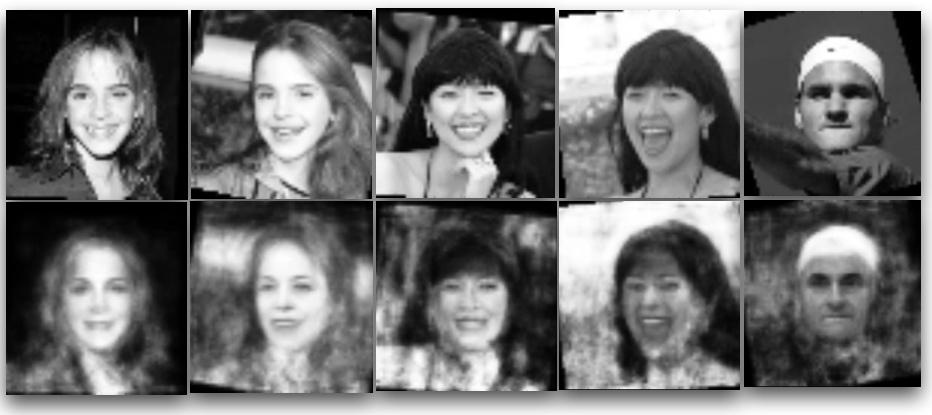
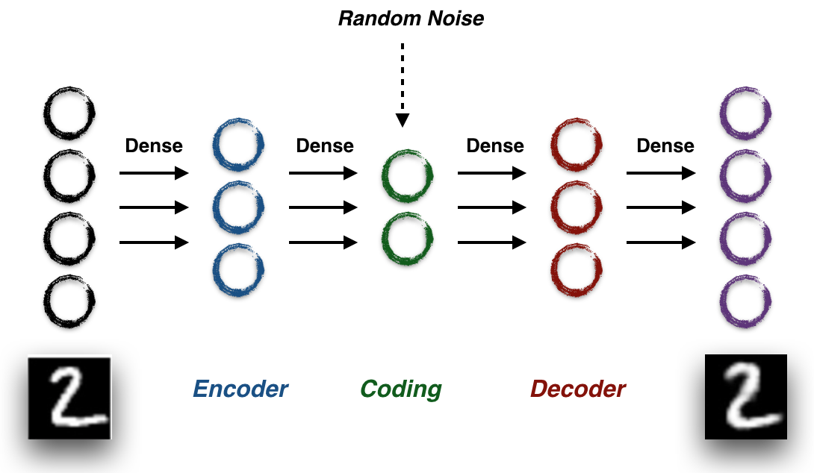
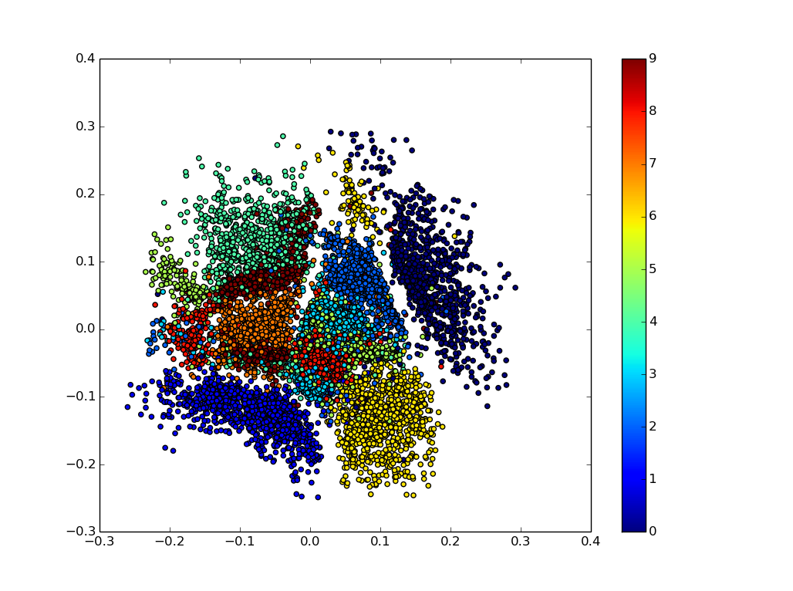
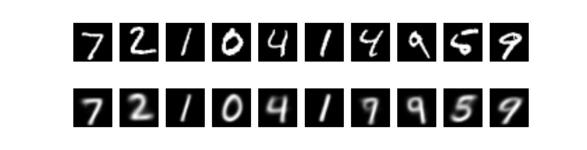
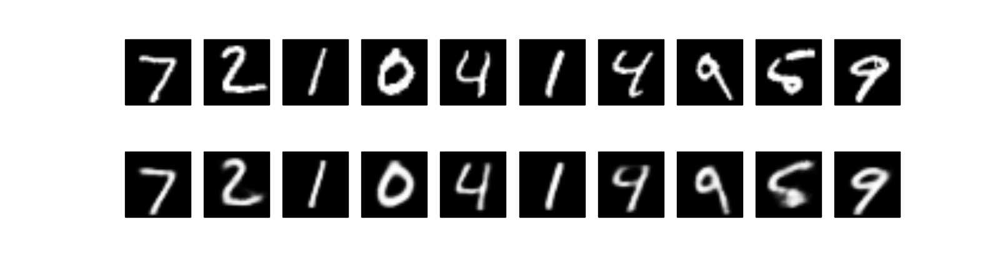
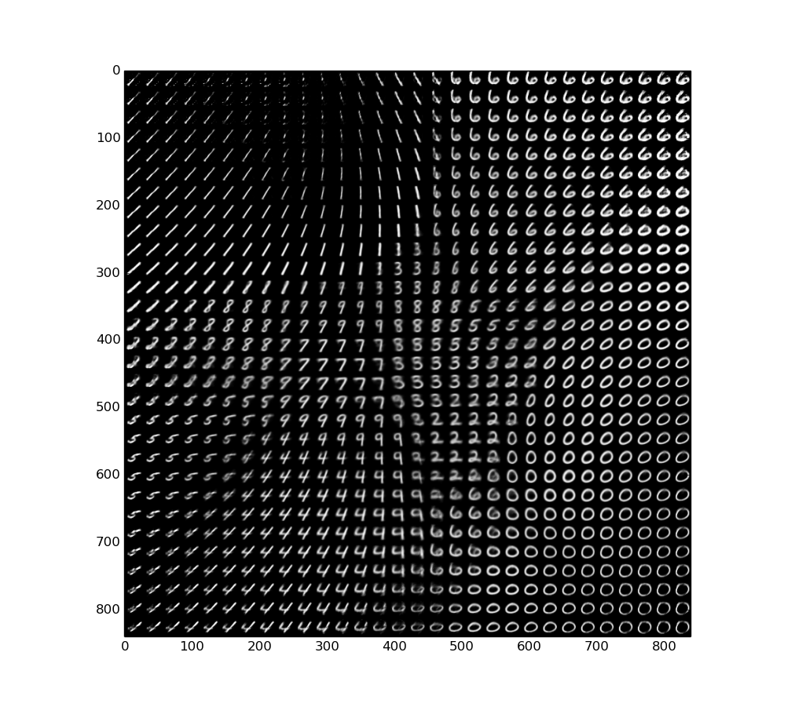

Variational AutoEncoder (VAE) is Easy to Understand
==================================




Before Everything 
-----
Every year, I want to do something for you on our anniversary, write a poem, sing a song, anything to express how grateful I have you as my wife, soul mate. Reality is, I'm just a boring man and do not know how to do those. I realized, one thing at least I might be good at, is research. Then I decide to write you this little technique article. Hope you can at least learn something, even if it may do nothing for your career. Hope you enjoy reading it, even if my English is not qualified. Most importantly, hope you feel my love. Happy 3rd anniversary, my darling.

About 2 years ago, I started to study Deep Learning from online resources. Thanks to Andrej Karpathy's beautiful blog and course note, I start to understand Neural Networks and start to code the DeuNet. Time proves it was a right decision and effort. I guess my initial effort inspired you a bit to apply it on your own Ph.D research. Your handwork helped yourself land to current job, doing real AI research. 

As well, I hope this initial research I have done will get you started on Bayesian modeling word. I believe Bayesian modeling is a non-avoidable field on your career. Bayesian people speaks a different language as NN people, which makes it unintuitive to understand. Among the hardest, there is no Andrej Karpathy yet on this topic. I spent a lot time during the past month, read a lot articles, paper, and code. This little is just a starting point, hope could lead us to a better and deeper understanding.

OK, let's get started.


Variantial AntoEncoder is just a Neural Network
----
Most articles on VAE (including the original paper) start with posterior distribution estimation, KL divergence, variational inference, and etc. Those 'fancy' terms means nothing to me at first time. We will get lost if trying to understand those terms and trying to follow the equations. I prefer to get the intuition of this model first, understand how this model works first, and play the code first. Then we can ask deeper questions, such as why this model works. Simply speaking, VAE is just a Neural Network (in the figure below) with a little trick in the loss function.



This is the structure of AVE, which is very similar with a classical [AutoEncoder](http://ufldl.stanford.edu/tutorial/unsupervised/Autoencoders/). We take raw image as network input, going through two simple fully connected layers to project the original dimension (eg. 784 for MINST) into a lower dimension (such as 2). Then use a symmetric 2 fully connected layers to reconstruct it back to the original image dimension. AutoEncoder as well as VAE, can be seen as a data compression model. In the training process, we can just set the training target as input image itself and use reconstruction error as the loss. Choosing an appropriate metric for image reconstruction is hard (but that's another [story](https://arxiv.org/abs/1512.09300)). We'll use the binary [cross-entropy](https://www.tensorflow.org/versions/r0.11/api_docs/python/nn.html#sigmoid_cross_entropy_with_logits), which is commonly used for data like MNIST. Let's visualize the structure with code (TensorFlow + Keras)


``` 
# Classical AutoEncoder
in_x = Input(shape=(784,))
encoded = Dense(128, activation='relu')(in_x)
encoded = Dense(2, activation='relu')(encoded)
decoded = Dense(128, activation='relu')(encoded)
output = Dense(784, activation='sigmoid')(encoded)
```
These 5 lines of code is the classical AutoEncoder, which is just a transfer of the network structure graph. Then, let's take a look the VAE.

``` 
# VAE
in_x = Input(shape=(784,))
encoded = Dense(128, activation='relu')(in_x)

z_mean = Dense(2, activation='relu')(encoded)
z_var = Dense(2, activation='relu')(encoded)
encoded = z_mean + K.exp(z_var / 2) * K.random_normal(shape=tf.shape(z_mean))

decoded = Dense(128, activation='relu')(encoded)
output = Dense(784, activation='sigmoid')(encoded)
```

This is almost the same the AutoEncoder, except we added a random noise on the `z_mean`. Intuitively, this random noise serves as a 'drop-out' like regularizer.

Another difference between AutoEncoder and VAE is the loss function. Here is the loss of AutoEncoder, which is simply binary cross-entropy.

``` 
# Classical AutoEncoder Loss
construction_loss = K.binary_crossentropy(output, in_x)
loss = tf.reduce_mean(construction_loss)
```

This is the VAE loss

``` 
# VAE Loss
construction_loss = K.binary_crossentropy(output, in_x)
KL_loss = -0.5 * K.sum(1+ z_var -K.square(z_mean) - K.exp(z_var),axis=-1)

loss = tf.reduce_mean(K.mean(construct_loss, axis=-1) + KL_loss)
```

The only difference is VAE loss has an extra `KL_loss`, which is an simple function of the coding variables `z_mean` and `z_var`. We can also treat this term as an special regularizer. In summary, VAE is just an AutoEncoder with some special regularizer. This regularizer provides some guides what `z_mean` and `z_var` should looks like. And because of this extra regularization term, it performs better than classical AutoEncoder. (We will discuss why the regularizer works in later section)

Now, let's have some fun to train this VAE we just built on MNIST. Firstly, let's train this VAE only with 2 dimension of the coding variables. In this way, we are encoding a $$$28x28$$$ MNIST image into 2 numbers. The following figure shows the trained 2-D coding variables from training images.
 


We can see different digits has been separated in the coding space already. Then let's take a look at how well this model reconstruct our testing (unseen) images.



The first row is the true testing image, and second row is reconstructed images. It's pretty cool, right? Even we can still see some blur in the reconstructed images, it mostly regenerated the raw image. Remember, we compress the 784 dimensions into only **2** dimensions! If we increase the coding dimensions from 2 to 12, here is the reconstructed images. It's much cleaner!



Also, remember VAE is a generative model, which means we can generate "new" images from nothing! Take the first example, we represent a $$$28 x 28 $$$ image into only **2** numbers. If we just scan the 2-D space and generate digits from there, here is what we can see.



We can generate any digit from 0 to 9. If we start from $$$(-0.15,-0.15)$$$ and slowly move those numbers to $$$(0.15, 0.15)$$$, we can see the beautiful figure in the beginning.  


